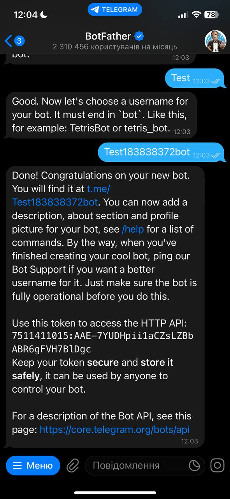

---
<div align="center">
  <h1>Welcome to My Project</h1>
</div>

## Description🗒️

This is a **Telegram bot** developed by me, intended for selling in-game items such as in-game currency for games like **Fortnite, Brawl Stars, Fall Guys**, etc.
The primary purpose of this bot is for commercial use. It is currently operational, and you can use it via the following link: **https://t.me/fnshophokagebot**

## Built with ⚙️
- **[aiogram](https://aiogram.dev/)** 

---
- **[PostgreSQL](https://www.postgresql.org/)**

---
- **[redis](https://redis.io/)**

---
- **[Google Cloud Storage](https://cloud.google.com/storage)**

---
>[!WARNING]
>My code may be shity and work unstable sometimes, it is my first big project

## Bot commands💻
```
/start
/admin_panel
```

## Usage preview📲
<video controls src="https://github.com/ke1rro/TelegramShopAiogram/blob/main/github_imgs/usage.gif" title="Title"></video>
---

# Quickstart▶️
>[!IMPORTANT]
>To run the bot, follow the instructions.
### Requirements
```
- docker
- ubuntu
```
>[!CAUTION]
>You can only run this repository with **Docker**

## 1. Setup .env file
```
BOT_TOKEN=YOUR_TOKEN

POSTGRES_HOST=db

POSTGRES_PORT=5432

POSTGRES_DB=DB

POSTGRES_USER=YOUR_USERS

POSTGRES_PASSWORD=YOUR_PASSWORD

POST_CHANNEL=CHANNEL_ID

PAYMENT_CHANNEL=CHANNEL_ID
```

## 2. Create Telegram bot via [BotFather](https://t.me/BotFather) and get API TOKEN


## 3. Get Google Cloud Storage account and **storage-key.json**
- Create bucket for images
- Create service account
- Donwload and save sotrage-key.json to project directory

## 4. Dockerfile & docker-compose.yml
docker-compose.yml
```yml
version: "3"
services:
  redis:
    image: redis:alpine
    env_file: .env
    restart: on-failure
    ports:
      - "6379:6379"
  db:
    image: postgres:16.3
    env_file: .env
    user: postgres
    environment:
      - POSTGRES_USER=$POSTGRES_USER
      - POSTGRES_PASSWORD=$POSTGRES_PASSWORD
      - POSTGRES_DB=$POSTGRES_DB
    volumes:
      - pgdata:/var/lib/postgresql/data
    restart: on-failure
    ports:
      - "5432:5432"
  bot:
    build: .
    env_file: .env
    command: sh -c "python3 main.py"
    restart: always
    depends_on:
      - db
      - redis

volumes:
  pgdata:
```
Dockerfile
```
FROM python:3.12.1

WORKDIR /app

COPY requirements.txt requirements.txt

RUN pip3 install --upgrade setuptools
RUN pip3 install -r requirements.txt

RUN chmod 755 .

COPY . .
```

## 5. Run docker-compose
```
sudo docker-compose up -d --build
```
## 6. Create PostgreSQL user and password inside container
```
docker ps
CONTAINER ID   IMAGE                         COMMAND
aa00b4c2364e   hokageshopdeployversion-bot   "sh -c 'python3 main…"
9ac877208f00   postgres:16.3                 "docker-entrypoint.s…"
7203ab11afc9   redis:alpine                  "docker-entrypoint.s…"

sudo docker exec -it 9ac877208f00 bash
```

## 7. Inside PostgreSQL container
```
psql -U postgres -d -DB

CREATE USER your_user WITH PASSWORD 'your_password';

GRANT ALL PRIVILEGES ON DATABASE your_database TO your_user;
```

## 8. Add yourself to admins table to be able to use `/admin_panel` command
```
psql -U your_user -d DB

INSERT INTO admins
VALUES
(1, 'your_telegram_username', 'your_telegram_firstname', your_telegram_id);
```

## 9. Add direct link to your channel in `app/keyboards/main_menu_kb.py`
```python
check_subscription = InlineKeyboardMarkup(inline_keyboard=[
    [InlineKeyboardButton(text='Підписатись', url='URL TO YOUR CHANNEL')],
    [InlineKeyboardButton(text=emojize('Перевірити підписку :check_mark_button:'), callback_data='check_sub')]])
```
